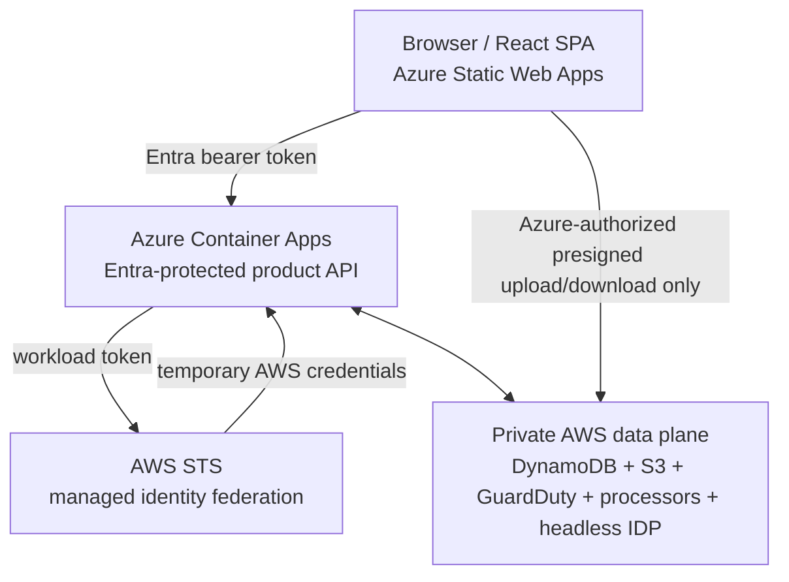

# Loan Document Platform

Production-oriented cross-cloud platform for securely ingesting loan packages,
selecting the winning Closing Disclosure, extracting its data, and preserving
immutable loan/document archives.

The product control plane runs in Azure. The React SPA uses Microsoft Entra SSO
and calls one Azure Container Apps REST API. AWS remains a private processing
data plane for the shared DynamoDB registry, versioned S3 documents/artifacts,
GuardDuty malware scanning, retained processors, and pinned headless IDP.

## System boundaries

- `apps/web` is the React SPA deployed to Azure Static Web Apps.
- `contracts/openapi/loan-api.yaml` is the authoritative browser/backend REST
  contract.
- `services/azure_api` supplies the FastAPI transport, Entra validation, health,
  and managed-identity-to-AWS credential provider.
- `services/loan_api` contains the provider-neutral loan/document lifecycle,
  archive, idempotency, and grant behavior used by the Azure API.
- `services/upload_processor` advances only an exact malware-clean, valid PDF
  version into headless IDP.
- `services/idp_postprocessor` selects/materializes the winning CD, starts the
  full pass through the supported S3 input path, and records extraction results.
- `config/idp/cd-screen-v1.json` performs text-only OCR over the full package
  plus lightweight classification/evidence extraction.
- `config/idp/cd-full-v1.json` preserves the supplied high-accuracy Forms+Tables/
  Opus extraction for the selected CD pages.
- `infra/azure` defines the Container Apps, managed identity, observability,
  container registry, and Static Web Apps resources.
- `infra/api` retains private AWS data/processing resources and the exact Azure
  workload federation role; it exposes no AWS product API.
- `scripts` contains repeatable Azure, Entra, AWS, GitHub, IDP, and deployment
  automation.

The browser does not call AppSync, the optional Jobs REST API, an AWS Loan API,
or AWS management services. The pinned IDP deployment is headless; its supported
runtime boundary is private S3/events, not a new public application API.

## Public names

- UI: `https://loans.<company-domain>`
- API: `https://api.loans.<company-domain>/v1`

Azure Static Web Apps and Container Apps use managed custom-domain certificates.
There is no `origin-api` hostname, CloudFront UI/API distribution, or public API
Gateway endpoint in the target architecture.

## Identity and archive model

`loanId` is the caller-provided stable business key. The Azure product API issues
an immutable `loanInstanceId` for each active incarnation. Archiving the first
incarnation produces display ID `23051_001`; recreating and archiving the same
business loan produces `23051_002`.

The Azure API issues `documentId` before the first upload and preserves it across
replacement PDFs. `uploadId` identifies one physical upload.
`processingExecutionId` identifies one platform processing orchestration. An IDP
input `ObjectKey`, upstream workflow ARN, and S3 `VersionId` are separate AWS
identifiers and never replace product IDs.

Archive is a read-only logical snapshot, not deletion. A loan archive freezes
its immutable instance and therefore every owned document by reference; it does
not copy or rename every object. Permanent purge remains a separate privileged,
legal-hold-aware workflow and is absent from UI v1.

## Authentication and cross-cloud access

Interactive users sign in through Entra authorization code with PKCE. The Azure
API validates exact token issuer, audience, lifetime, tenant, token type, actor,
client, scope, and assigned role before any AWS access.

The Container App has a dedicated user-assigned managed identity. It requests a
separate workload token for a dedicated AWS-federation audience and exchanges it
through `AssumeRoleWithWebIdentity`. AWS trust matches the exact tenant issuer,
audience, and managed-identity subject. Returned credentials are temporary,
least-privilege, memory-only, and refreshed before expiry. The browser's bearer
token is never forwarded to AWS.

## Repository and delivery bootstrap

1. Copy `config/environments/prod.example.json` to an ignored environment file
   and provide the listed non-secret Azure, AWS, Entra, DNS, and GitHub values.
2. Authenticate to Azure with the intended tenant/subscription and to AWS through
   an IAM Identity Center profile. Do not create a publish profile, client
   secret, or AWS access key.
3. Run `scripts/bootstrap.ps1 -InstallMissing`; then run it with the ignored
   environment file to verify both cloud identities.
4. Run `scripts/provision-github.ps1` to create/configure the public repository,
   protected environment, exact GitHub-to-AWS OIDC role, and AWS bootstrap.
5. Run `scripts/configure-github-protection.ps1` after the reviewed baseline is
   on `main` to enforce validation, exact-head Copilot review, resolved
   conversations, and the protected production environment.
6. Run `scripts/provision-entra.ps1` for the product API, SPA, and optional
   certificate-authenticated service client. Run `scripts/deploy-azure.ps1
   -FoundationOnly`, then `scripts/provision-entra-federation.ps1` for the
   dedicated managed-identity audience.
7. Run `scripts/provision-github-azure.ps1` to establish exact GitHub-to-Azure
   OIDC and exact-scope deployment roles, then `scripts/sync-github-entra.ps1`
   to publish only non-secret IDs to the protected GitHub environment.
8. Run `scripts/deploy-all.ps1 -SkipAzureFoundation -SkipEntra` for the private
   AWS runtime, pinned headless IDP, deep-federation-gated Azure API revision,
   and optional Static Web Apps publication. Stage the API certificate with
   `-BindApiCustomDomain`; run `scripts/cutover-api-domain.ps1` only after the
   default hostname passes acceptance.
9. Complete every live authorization, malware, IDP, restore,
   certificate, alarm, cost, and synthetic end-to-end acceptance gate in the
   runbook before declaring production ready.

No script may request or print an AWS access key, Entra/Azure application secret,
managed-identity token, temporary STS credential, certificate private key, PDF,
OCR text, extracted value, or signed URL.

The repository is public to use standard free GitHub-hosted Actions and public-
repository protection. Public visibility does not make mortgage data public:
real documents and derived values are prohibited from source control and CI. No
open-source license is granted for project-owned code; see `LICENSE`. Generated
third-party assets retain the licenses in [third-party notices](THIRD_PARTY_NOTICES.md).

## Spec-driven development

This repository follows GitHub Spec Kit v0.12.15 with native Claude Code skills
and PowerShell workflow. Durable rules live in the
[project constitution](.specify/memory/constitution.md). The active
[Azure control-plane feature](specs/002-azure-api-control-plane/spec.md) defines
the migration; the [baseline feature](specs/001-loan-document-platform/spec.md)
records the original behavior that must be preserved. The OpenAPI contract
remains authoritative for the public wire format.

In Claude Code, restart once after cloning so `.claude/skills` is discovered,
then use `/speckit-specify`, `/speckit-clarify`, `/speckit-plan`,
`/speckit-tasks`, `/speckit-analyze`, `/speckit-implement`, and
`/speckit-converge`. See the [project workflow](docs/spec-driven-development.md).
Upstream scaffold provenance is pinned in `vendor/spec-kit.lock.json` and
refreshed only through `scripts/sync-spec-kit.ps1`.

## Documentation

- [Architecture](docs/architecture.md)
- [Claude UI handoff](docs/ui-handoff.md)
- [Security and certificates](docs/security.md)
- [Operations runbook](docs/runbook.md)
- [GitHub delivery](docs/github-delivery.md)
- [Spec-driven development](docs/spec-driven-development.md)
- [Azure API control-plane specification](specs/002-azure-api-control-plane/spec.md)
- [OpenAPI contract](contracts/openapi/loan-api.yaml)
