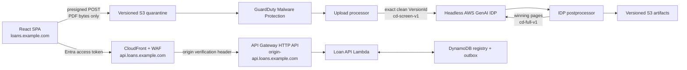

# Production architecture

## Outcome

The platform accepts an arbitrary multi-document loan package whose Closing Disclosure boundaries are unknown, performs inexpensive text OCR and page-level classification across the package, selects one defensible 5–6 page borrower CD, and applies the existing high-accuracy full extraction only to that winner.



The UI and API are separate applications. The AWS IDP accelerator runs headless because authentication, authorization, and the product UI belong to this platform.

## Trust boundaries

1. Microsoft Entra authenticates users and confidential clients.
2. API Gateway validates the tenant-specific v2 issuer, signature, exact API audience, and token lifetime.
3. Lambda validates route permissions from delegated `scp` or application `roles`, expected tenant, token type, and an allowlist of client application IDs.
4. CloudFront/WAF is the public API edge. The Regional API origin is protected by an origin-only header in addition to OAuth. The default `execute-api` endpoint is disabled.
5. The browser never receives AWS credentials. PDF bytes go directly to a short-lived, condition-constrained S3 presigned POST.
6. Uploaded content is untrusted until an exact S3 version passes malware and PDF validation.
7. Model output is untrusted data. It has no tools or side effects and must satisfy the configured JSON schema and deterministic selection rules.

## Public names

- `https://loans.<company-domain>` — CloudFront-hosted React SPA.
- `https://api.loans.<company-domain>` — CloudFront/WAF API edge.
- `https://origin-api.loans.<company-domain>` — Regional API Gateway origin, not advertised to clients.
- `/v1` — API version. Versions do not appear in DNS names.

Production, staging, and development receive separate stacks, Entra registrations, origins, KMS keys, and hostnames. Production does not accept a localhost redirect URI.

## Identity and archive model

| Name | Source | Meaning |
|---|---|---|
| `loanId` | Caller | Stable business key such as `23051` |
| `loanInstanceId` | AWS API | Immutable incarnation of that business loan |
| `documentId` | AWS API | Stable logical document identity returned before first upload |
| `uploadId` | AWS API | One physical uploaded/replacement PDF |
| `processingExecutionId` | AWS API | One screening or full-extraction run |
| S3 `VersionId` | S3 | Exact immutable bytes used by a run |
| `archiveSequence` | DynamoDB transaction | Monotonic numeric archive revision |

Archiving active loan instance one for `23051` produces display alias `23051_001`. Recreating `23051` creates a new `loanInstanceId`; archiving that instance produces `23051_002`. Sequence formatting has a minimum of three digits, not a maximum.

A loan archive freezes the immutable instance and writes a manifest/reference record. It does not copy, rename, or transact over every document. All documents are already beneath the immutable `loanInstanceId`, so they are included logically in O(1) state change. The transaction conditions the current head revision, advances the sequence, removes the current pointer, writes the archive reference, and writes an outbox event.

A document archive freezes its current `uploadId` and allocates `documentId_001`. A replacement upload retains the stable `documentId`, gets a new `uploadId`, and later archives as `_002`.

All mutations require an `Idempotency-Key`. The stored canonical request hash distinguishes a safe retry from reuse with a changed request. A retry of the same archive intent returns the original `_001`; it never allocates `_002`.

## DynamoDB single-table keys

```text
PK = TENANT#{tid}#LOAN#{loanId}

SK = HEAD
     INSTANCE#{loanInstanceId}
     ARCHIVE#{000000000001}
     INSTANCE#{loanInstanceId}#DOC#{documentId}
     INSTANCE#{loanInstanceId}#DOC#{documentId}#UPLOAD#{uploadId}
     INSTANCE#{loanInstanceId}#DOC#{documentId}#ARCHIVE#{000000000001}
     OUTBOX#{eventId}
```

Idempotency records use a separate partition derived from tenant, immutable actor, route, and key. Upload records project an opaque object-key lookup into `GSI1` so GuardDuty scan events can be reconciled without parsing business values from keys.

PITR, deletion protection, customer-managed KMS encryption, on-demand capacity, TTL for transient idempotency records, and AWS Backup are enabled. Archived business records have no TTL.

## Immutable object layout

```text
tenants/{tenantId}/loans/{loanId}/instances/{loanInstanceId}/
  documents/{documentId}/uploads/{uploadId}/quarantine/source.pdf
  documents/{documentId}/uploads/{uploadId}/selected/closing-disclosure.pdf
  documents/{documentId}/uploads/{uploadId}/results/data-points.json
  archives/loans/{loanArchiveSequence}/manifest.json
```

Bucket versioning and checksums are mandatory. Processing and downloads pin the `VersionId`; they never read “latest.” Archive records reference keys, versions, SHA-256 values, config digests, and execution metadata.

## Upload and processing sequence

1. `POST /v1/loans/{loanId}/documents` creates `documentId`, `uploadId`, expected size/checksum, and a presigned S3 POST.
2. The browser uploads the PDF directly to the quarantine key.
3. `POST .../uploads/{uploadId}/complete` does not upload bytes. It records that the client finished and captures the exact object version, size, and checksum.
4. GuardDuty Malware Protection scans the object. At-least-once scan events are deduplicated.
5. Only `NO_THREATS_FOUND` advances. Threats, unsupported scans, access failures, and scan failures enter `HOLD`/`REJECTED` and never reach IDP.
6. The upload processor checks PDF magic, parser validity, encryption, page limit, size, and checksum, then copies the exact version to the IDP input bucket with `config-version=cd-screen-v1`.
7. Screening uses Textract `DetectDocumentText` (empty OCR feature list), page-level multimodal classification over every page, one page of neighboring context, LLM-determined section splitting, and a small extraction schema.
8. The deterministic selector compares borrower CD sections. Identity conflict, missing ranking evidence, or a tie produces `HOLD`; it does not guess.
9. The selector materializes only the winning page IDs into a new PDF and stores it as a versioned selected artifact.
10. That selected PDF enters IDP with `config-version=cd-full-v1`, which preserves the supplied Forms+Tables/Opus configuration.
11. The postprocessor validates and stores final structured output, config/model provenance, and the exact source/selected versions, then marks the document `SUCCEEDED`.

## IDP release model

The upstream accelerator is pinned in `vendor/idp.lock.json`. Development can build from source, but production deploys an immutable template previously published from that exact commit. Configurations are complete named snapshots:

- `cd-screen-v1` — text-only all-page screening.
- `cd-full-v1` — selected-page full extraction and accuracy baseline.

The config version is recorded in S3 metadata and document tracking. Upgrades first run synthetic/regression packages and compare accuracy, selection outcome, latency, and cost. Production never follows the upstream `main` branch.

## Availability and spend controls

- SQS/EventBridge integrations are idempotent, have bounded retries, and route poison events to DLQs.
- Lambda reserved concurrency and IDP maximum workflow concurrency limit blast radius and cost.
- Upload/page/token limits are hard controls; the $100 AWS Budget is delayed alerting, not a hard stop.
- Alarms cover API 5xx/latency/throttling, denied tokens, Lambda errors, queue age/DLQ, IDP failures, GuardDuty results, DynamoDB throttling, certificate expiry, and spend.
- Logs contain identifiers/correlation IDs and status only—never document content, extracted values, tokens, signed URLs, or sensitive filenames.

## Source and delivery boundary

The public source repository is GitHub. It contains no customer documents, derived values, tenant/account identifiers, or credentials. Pull-request validation has no AWS permissions. A manually dispatched production job uses GitHub OIDC to request short-lived credentials for an AWS role whose trust is restricted to the exact repository and production environment subject. GitHub stores no AWS access key. The deployment role can deliver reviewed CloudFormation changes and pass only the named CloudFormation execution role; it is separate from application runtime roles.
