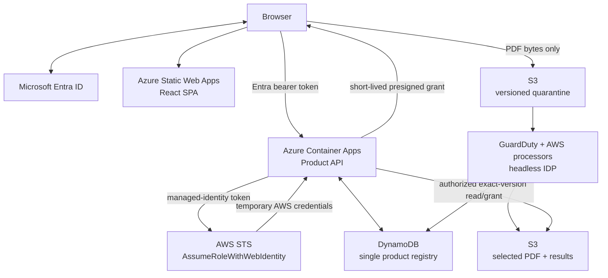

# Production architecture

## Outcome

The platform accepts an arbitrary multi-document loan package whose Closing
Disclosure boundaries are unknown, performs inexpensive text OCR and page-level
classification across the package, selects one defensible borrower CD, and
applies the existing high-accuracy full extraction only to that winner.

Azure owns the product control plane: the React SPA and every public loan,
document, archive, status, data-point, and download-grant operation. AWS retains
the private document-processing data plane: DynamoDB, versioned S3, GuardDuty,
the upload/postprocessing functions, and the pinned headless IDP accelerator.



The browser never calls AppSync, the optional IDP Jobs REST API, an AWS Loan
API, DynamoDB, or an IDP workflow. The Azure API never forwards the user's
bearer token to AWS.

## Public application boundary

- `https://loans.<company-domain>` — React SPA on Azure Static Web Apps.
- `https://api.loans.<company-domain>/v1` — canonical REST API on Azure
  Container Apps with an Azure-managed custom-domain certificate.
- `/runtime-config.json` — public SPA settings generated during deployment.

There is no public `origin-api` hostname. The former CloudFront API
distribution, API Gateway, Lambda Loan API, and origin-verification secret are
absent from the deployable state. A separately reviewed cleanup is required only
when migrating infrastructure created by an older repository revision. Azure
and service-default hostnames are not Entra production redirect URIs. In
production, `/v1` accepts only the configured custom API host; the Container
Apps default FQDN remains reachable only for `/health` and `/ready` deployment
probes. Production SPA publication requires recorded custom-domain binding and
DNS cutover.

Production, staging, and development use separate Azure resource groups,
Container Apps environments, Static Web Apps, managed identities, Entra
registrations, AWS roles/stacks, KMS keys, buckets, and hostnames. Production
does not accept localhost redirect URIs.

## Trust boundaries

1. Microsoft Entra authenticates interactive users and confidential callers.
2. The Azure API cryptographically validates the tenant-specific v2 issuer,
   signature, algorithm, exact API audience, time claims, tenant, token type,
   immutable actor, allowed client, emergency denylist, and route permission.
3. A delegated request requires both its declared `scp` value and matching
   assigned application role. An app-only request requires an exact allowlisted
   client, the matching role, `idtyp=app`, and `azpacr=2` certificate proof.
4. The Container App's dedicated user-assigned managed identity obtains a
   separate v1 Entra token for the dedicated AWS-federation audience.
5. AWS STS accepts that workload token only through an OIDC trust matching the
   exact `https://sts.windows.net/<tenant-id>/` issuer, audience, and managed
   identity subject. It returns bounded temporary credentials for one narrow
   runtime role.
6. The Azure API uses those credentials only for the exact DynamoDB table and
   indexes, S3 prefixes, KMS key operations, and private integration actions
   required by the product contract.
7. The browser receives no AWS credential. It receives only an operation- and
   object-constrained upload or download grant after Azure authorization.
8. Uploaded bytes are untrusted until the exact S3 version passes malware,
   integrity, and deterministic PDF validation.
9. Model output is untrusted data. It has no tools or side effects and must
   satisfy the configured schema and deterministic selection rules.

Container Apps ingress authentication may be enabled as defense in depth, but
application-level token validation is authoritative. Proxy or injected identity
headers alone never authenticate a product request.

## Identity and archive model

| Name | Issuer | Meaning |
|---|---|---|
| `tenantId` | Entra validated `tid` | Security and data partition |
| `loanId` | Caller | Stable business key such as `23051` |
| `loanInstanceId` | Azure product API | Immutable incarnation of that business loan |
| `documentId` | Azure product API | Stable logical document identity returned before upload |
| `uploadId` | Azure product API | One physical uploaded or replacement PDF |
| `processingExecutionId` | Azure product API | One platform screening/full orchestration |
| IDP `ObjectKey` | Private IDP S3 adapter | One upstream stage input object |
| IDP workflow execution ARN | Headless AWS IDP | One upstream screening or full-stage attempt |
| S3 `VersionId` | S3 | Exact immutable bytes used by a run |
| `archiveSequence` | DynamoDB transaction | Monotonic loan or document revision |

These values are never substituted for one another. In particular, an IDP
object key or execution ARN is not the product `documentId` or
`processingExecutionId`.

Archiving active loan instance one for `23051` produces display alias
`23051_001`. Recreating `23051` creates a new `loanInstanceId`; archiving that
instance produces `23051_002`. Sequence formatting has a minimum of three
digits, not a maximum.

A loan archive freezes the immutable instance and writes a manifest/reference
record. It does not copy, rename, or transact over every document. All documents
already belong to that immutable `loanInstanceId`, so one conditional DynamoDB
transaction can advance the sequence, remove the current pointer, write the
archive reference, and write an outbox event.

A document archive freezes its current `uploadId` and allocates
`documentId_001`. A replacement retains the stable `documentId`, receives a new
`uploadId`, and later archives as `_002`.

All mutations require an `Idempotency-Key`. The stored canonical request hash
distinguishes a safe retry from reuse with changed content. A retry of the same
archive intent returns the original `_001`; it never allocates `_002`.

## One shared registry

The migration keeps DynamoDB as the only mutable loan/document registry. Azure
uses temporary STS credentials to execute the same conditional reads,
transactions, and idempotency operations used by the retained AWS processors.
No Cosmos DB or AppSync table mirrors writable product state.

```text
PK = TENANT#{tenantId}#LOAN#{loanId}

SK = HEAD
     INSTANCE#{loanInstanceId}
     ARCHIVE#{000000000001}
     INSTANCE#{loanInstanceId}#DOC#{documentId}
     INSTANCE#{loanInstanceId}#DOC#{documentId}#UPLOAD#{uploadId}
     INSTANCE#{loanInstanceId}#DOC#{documentId}#ARCHIVE#{000000000001}
     OUTBOX#{eventId}
```

Idempotency records remain in a separate tenant/actor/route/key-derived
partition. Upload records project an opaque object lookup into `GSI1` so
GuardDuty events can be reconciled without deriving authority from object-key
text. Workflow records also project a bounded hash of the execution ARN and
verify the full stored ARN after lookup.

DynamoDB PITR, deletion protection, customer-managed KMS encryption, on-demand
capacity, TTL only for transient records, and AWS Backup remain enabled.
Archived business records have no TTL.

## Immutable object layout

```text
Source-bucket quarantine (untrusted until exact-version validation):
  quarantine/tenants/{tenantId}/loans/{loanId}/instances/{loanInstanceId}/
    documents/{documentId}/uploads/{uploadId}/source.pdf

Source-bucket immutable artifacts (outside the quarantine prefix):
  tenants/{tenantId}/loans/{loanId}/instances/{loanInstanceId}/
    documents/{documentId}/uploads/{uploadId}/artifacts/{processingExecutionId}/
      selection-decision.json
      selected.pdf
      data-points.json
    archives/loans/{loanArchiveSequence}/manifest.json

IDP input bucket:
  screen/{processingExecutionId}/{documentId}/{uploadId}.pdf
  full/{processingExecutionId}/{documentId}/{uploadId}.pdf
```

Bucket versioning and checksums are mandatory. Processing and downloads pin the
`VersionId`; they never read an unversioned “latest.” Archive records reference
keys, versions, SHA-256 values, configuration digests, and execution metadata.
Object paths aid operations but are not authorization evidence.

Loan archive creation is bounded by `maximumLoanArchiveDocuments` and
`maximumLoanArchiveManifestBytes`; registry partition reads are independently
bounded by `maximumQueryItems`. Archive reads require both the stored checksum
and the checksum returned by S3, hash the bounded response bytes again, and
close the response stream on every path.

## Request and upload sequence

1. The SPA obtains an Entra access token for the Azure product API.
2. `POST /v1/loans/{loanId}/documents` causes Azure to authorize the caller,
   allocate `documentId` and `uploadId`, transact the DynamoDB registry, and
   return a condition-constrained presigned S3 POST.
3. If AWS credentials are not fresh enough for the bounded operation/grant,
   Azure obtains a managed-identity workload token and exchanges it with STS.
   Credentials are cached in memory per replica and refreshed before expiry.
4. The browser uploads the PDF directly to versioned S3 quarantine. The form
   contains no Entra token or AWS access key.
5. `POST .../uploads/{uploadId}/complete` carries no PDF. Azure heads the exact
   object, validates size/checksum/type/metadata/encryption, records its
   `VersionId`, and allocates `processingExecutionId` conditionally.
6. Completion and GuardDuty events may arrive in either order. The retained AWS
   upload processor advances only when both facts refer to the same version.

An Azure timeout after an AWS commit is recovered through the persisted
idempotency record. The service never blindly repeats an indeterminate mutation
with a new key.

## Headless IDP processing sequence

1. Only `NO_THREATS_FOUND` for the completed version can advance. Threat,
   unsupported, failed, conflicting, and unknown scans fail closed.
2. The upload processor verifies PDF magic, parser validity, encryption, page
   and size limits, checksum, and exact object version.
3. It copies that version to the IDP input bucket as
   `screen/{processingExecutionId}/{documentId}/{uploadId}.pdf`, attaching the
   pinned `cd-screen-v1` provenance and registry-routing metadata.
4. Screening uses Textract `DetectDocumentText` with no Forms/Tables features,
   page-level multimodal classification over every page, one neighboring context
   page, LLM-determined section splitting, and the small evidence schema.
5. The deterministic selector compares borrower CD candidates. Identity
   conflict, missing ranking evidence, or a tie produces `HOLD`.
6. The postprocessor materializes only the selected page IDs into a versioned
   PDF and copies that exact version to the `full/...` IDP input key.
7. `cd-full-v1` preserves the reviewed Forms+Tables/Opus extraction on only the
   selected artifact.
8. The postprocessor validates and stores final JSON, selection/config/model
   provenance, source/selected/output versions, and the upstream workflow ARNs,
   then marks the platform execution `SUCCEEDED`.
9. Azure reads status and exact artifact references from the shared registry.
   It returns bounded JSON inline or a fresh, version-pinned download grant.

The pinned deployment uses `--headless`, whose transformation removes AppSync.
The optional private Jobs REST API is not enabled and its ZIP contract is not
used. Runtime integration is the supported S3/event path; Azure does not invoke
the state machine directly.

## Release, availability, and spend controls

The upstream accelerator is pinned in `vendor/idp.lock.json`. Production deploys
an immutable template from that exact commit and named configuration snapshots:

- `cd-screen-v1` — text-only all-page screening;
- `cd-full-v1` — selected-page full extraction and accuracy baseline.

Upgrades first run synthetic/regression packages and compare accuracy, selection,
latency, and cost. Production never follows upstream `main`.

- Container Apps uses health/readiness probes, immutable revisions, bounded
  autoscaling, and rollback to a previously accepted image. The current loan
  domain retains module-global AWS clients, so a per-replica `domain_lock`
  serializes credential acquisition, client binding, and every domain dispatch
  as the correctness boundary. The HTTP scale-out target is pinned to `1` to
  minimize head-of-line waiting while `apiMaxReplicas` preserves horizontal
  scale. Azure treats that target as an autoscaling signal, not a hard request-
  admission or concurrency cap; requests may still queue at a replica and must
  still pass through the lock. Raising the target or removing the lock requires
  first replacing module-global clients with a re-entrant, request-scoped domain
  seam and repeating concurrency/load acceptance.
- Managed-identity and STS credentials are memory-only, single-flight refreshed,
  and never persisted in Azure configuration, Key Vault, DynamoDB, or logs.
- The loan domain constructs no AWS clients during import. The Azure credential
  boundary binds DynamoDB, S3, and Lambda clients with explicit connect/read
  timeouts, TCP keepalive, and three total standard-mode attempts; the unsigned
  STS federation client uses the same network bounds.
- SQS/EventBridge integrations are idempotent, have bounded retries, and route
  poison events to DLQs.
- Reconciliation detects missed GuardDuty/IDP events and stale workflow markers.
- Lambda and IDP concurrency limit AWS cost and blast radius. Upload/page/token
  limits are hard controls; the configured AWS and Azure budgets are delayed
  notifications, not hard spending stops.
- Baseline IaC alarms cover Azure API 5xx volume and latency, AWS processor
  errors, processor DLQs, DynamoDB throttling, and Azure/AWS spend. Production
  acceptance still requires environment-specific auth/federation/readiness/STS,
  GuardDuty-outcome, IDP-workflow, and certificate-renewal alerting plus tested
  on-call delivery; those broader live controls are not implied by the baseline
  templates.
- Telemetry contains safe identifiers, correlation IDs, and status only—never
  PDF/OCR content, extracted values, tokens, temporary credentials, signed URLs,
  or sensitive filenames.

## Source and delivery boundary

GitHub is the public source host. Pull-request validation receives no Azure or
AWS production permission. A manually approved production workflow uses
GitHub OIDC independently with Azure and AWS; each federated identity is
restricted to the exact repository and production environment. GitHub stores no
Azure client secret, publish profile, AWS access key, or workload certificate.

Azure deployment identity, Azure API runtime identity, AWS deployment role,
platform CloudFormation execution role, IDP CloudFormation execution role, and
Azure-to-AWS runtime role are separate principals. GitHub can address only the
two configured stack ARNs and pass the matching execution roles. Bootstrap-owned
permissions boundaries cap every stack-created role, while a verified stack
policy blocks ordinary replacement/deletion of S3, DynamoDB, and KMS resources.
None can silently assume another principal's responsibilities.
